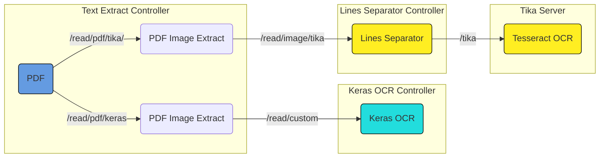

# Dự án chính

## Hướng dẫn chạy

Dự án có 3 module nằm trong thư mục `tesseract_api_java`

Tại local: Biên dịch và chạy trong Netbeans

Tại server: Biên dịch ra file `.jar` ở thư mục `target` ở ổ đĩa tạm, copy file `.jar` và các dependencies ở thư mục `lib` sang server. Chạy module bằng bash:

```bash
# Đặt biến môi trường
export JAVA_HOME="<thư mục chứa JDK 17>"
export PATH=$JAVA_HOME/bin:$PATH
# Chạy module, lưu đầu ra vào file nohup.out
cd <đường dẫn tới module>
rm nohup.out
# Lưu PID của tiến trình vào file pid.file, để tiện dừng module khi cần
nohup java -Xmx1024m -cp './<tên file jar>.jar:./lib/*' <package chứa main> & echo $!
> ./pid.file
tail -f nohup.out
```

Dừng module bằng bash:

```bash
kill $(cat ./pid.file)
```

# Bản prototype của dự án, đã không còn sử dụng

## Hướng dẫn chạy
- Chạy API nhận diện chữ bằng Keras OCR: `uvicorn keras_controller.keras_ocr_controller:app --host 0.0.0.0 --port 12345`
- Chạy API tách dòng để gửi lên Tika server: `uvicorn lines_separator.lines_separator_controller:app --host 0.0.0.0 --port 12345`
- Chạy API tách ảnh từ PDF: `uvicorn text_extractor.text_extract_controller:app --host 0.0.0.0 --port 12345`
- Mở giao diện người dùng: mở `frontend/page.html`


## Môi trường ảo
Tạo môi trường ảo có tên `.venv`:

`py -m venv .venv`

## Cài đặt thư viện
- `pip install matplotlib`
- `pip install tensorflow`
- `pip install keras-ocr`
- `pip install fastapi`
- `pip install "uvicorn[standard]"`
- `pip install python-multipart`
- `pip install httpx`
- `pip install opencv-python`
- `pip install PyMuPDF`

Nếu cài đặt trên server air-gapped: 
- Tải xuống ở server khác:
	- `mkdir downloaded-lib`
	- `mkdir <tên thư viện>`
	- `pip download --only-binary :all: --dest=downloaded-lib/<tên thư viện> --no-cache <tên thư viện>`
- Chuyển qua server air-gapped:
	- `scp <IP server chứa file>://<đường dẫn tới file> <đường dẫn server air-gapped>`
- Cài đặt trên server air-gapped:
	- `pip install <file .whl> --no-index --find-links=<thư mục chứa .whl> --force-reinstall --no-build-isolation`
- Tải xuống `craft_mlt_25k.h5`, `crnn_kurapan.h5`, `crnn_kurapan_notop.h5`, cho vào `root/.keras_ocr`
	- `https://github.com/faustomorales/keras-ocr/releases/download/v0.8.4/craft_mlt_25k.h5`
	- `https://github.com/faustomorales/keras-ocr/releases/download/v0.8.4/crnn_kurapan.h5`
	- `https://github.com/faustomorales/keras-ocr/releases/download/v0.8.4/crnn_kurapan_notop.h5`
	
**Nếu Tensorflow báo cần dùng numpy 1.23, cần cài lại numpy 1.23 sau khi cài các thư viện khác**


Nếu code import keras-ocr bị lỗi thì cài thêm thư viện vào máy như sau:
```shell
sudo apt-get update
sudo apt-get install ffmpeg libsm6 libxext6
```

Để có thể dùng GPU cần chạy ở WSL, vì từ tensorflow version 2.10 không chạy GPU trực tiếp


### Cài đặt Tesseract (RHEL 7)
- Copy file ở `https://download.opensuse.org/repositories/home:/Alexander_Pozdnyakov/RHEL_7/home:Alexander_Pozdnyakov.repo` cho vào `cd /etc/yum.repo.d`
- Kiểm tra repo cài xong chưa``


## Powershell chạy activate môi trường cần set:

### Kiểm tra quyền chạy
`Get-ExecutionPolicy -List`


### Đổi quyền chạy
- `Set-ExecutionPolicy -ExecutionPolicy Undefined -Scope LocalMachine`
- `Set-ExecutionPolicy -ExecutionPolicy RemoteSigned -Scope CurrentUser`


# Kiến trúc



## **text_extract_controller**
API tách file pdf thành các trang ảnh, rồi gửi song song tới `lines_separator_controller` hoặc `keras_ocr_controller`

### Endpoints
- `read/pdf/keras`: POST. Nhận 1 file PDF, tách thành các trang, gửi song song tới `keras_ocr_controller`. Trả về JSON theo trang
	- body: Không có
	- uploaded_file: Upload file, dạng PDF
	
- `read/pdf/tika`: POST. Nhận 1 file PDF, tách thành các trang, gửi song song tới `lines_separator_controller`. Trả về JSON theo dòng
	- body: Không có
	- uploaded_file: Upload file, dạng PDF

### Dependencies
Thư viện:
- FastAPI: Tạo API
- asyncio: Tạo luồng xử lý song song

Script:
- request_handler: Tạo HTTP request gửi các API khác
- pdf_images_extract: Tách ảnh ra khỏi PDF


## **keras_ocr_controller**
API nhận diện ảnh bằng Keras OCR. Chỉ nhận diện chữ và vị trí chữ, không nhận diện dấu cách.

### Endpoints
- `/return`: GET. Trả về kết quả của lần đọc gần nhất ở dạng text
- `/read/auto_image`: POST. Đọc 1 ảnh được tạo tự động, trả về kết quả dạng text
- `/read/test_set`: POST. Đọc các ảnh từ file `test_set`, trả về kết quả dạng text. Các file không có `pic` trong tên file sẽ bị bỏ qua
- `/read/custom`: POST. Đọc ảnh được tải lên qua multipart
	- body: Không có
	- uploaded_file: UploadFile, dạng ảnh
	
### Dependencies
Thư viện:
- FastAPI: Tạo API
- PIL.Image: Chuyển đổi định dạng file ảnh

Script:
- test_generator: Tạo file ảnh test
- text_detector: Đọc chữ bằng Keras

## **lines_separator_controller**
API cắt các dòng chữ ra khỏi ảnh, rồi gửi song song tới Tika server. Có nhận diện dấu cách

### Endpoints
- `/read/image/tika`: POST. Nhận 1 ảnh, tách thành từng dòng, gửi song song các dòng tới Tika server. Trả về JSON cú pháp {"<số dòng>" : "<nội dung dòng (text)>"}
	- body: Không có
	- uploaded_file: UploadFile, dạng ảnh

### Dependencies
Thư viện:
- FastAPI: Tạo API
- asyncio: Tạo các luồng xử lý song song
- numpy: Chuyển đổi định dạng ảnh
- PIL.Image: Chuyển đổi định dạng ảnh
- cv2: thư viện opencv để xử lý ảnh và cắt ảnh

Script:
- request_handler: Tạo HTTP request gửi các API khác
- lines_separator: tách ảnh thành các file ảnh nhỏ theo dòng

## Tài liệu
Cách fine tune model và lưu trọng số:
- https://keras-ocr.readthedocs.io/en/latest/examples/fine_tuning_recognizer.html
- https://stackoverflow.com/questions/57152978/keras-how-to-save-models-or-weights

Độ phân giải tối ưu cho Tesseract
- https://groups.google.com/g/tesseract-ocr/c/Wdh_JJwnw94/m/24JHDYQbBQAJ
- https://willus.com/blog.shtml?tesseract_accuracy

Cài tensorflow từ mã nguồn
- https://www.tensorflow.org/install/source
