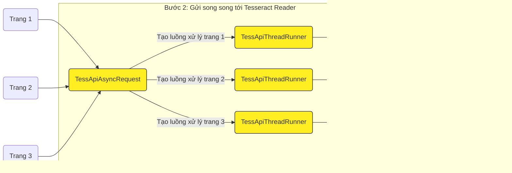

# Tesseract API Java

### Cài dặt và chạy
Trên máy data node 3:

##### Tesseract Paragraph Extract:
IP: http://10.14.222.194:11235

Chạy:
```
cd /opt/tesseract_api/tess_paragraph_extract
./run.sh
```

Ngừng chạy:
```
cd /opt/tesseract_api/tess_paragraph_extract
./stop.sh
```

##### Tesseract Reader:
IP: http://10.14.222.194:12321

Chạy:
```
cd /opt/tesseract_api/tess_api
./run.sh
```

Ngừng chạy:
```
cd /opt/tesseract_api/tess_api
./stop.sh
```

### Tại sao dùng JavaCPP thay vì Pytesseract, Tess4j


Dùng JavaCPP thì:


### Kiến trúc phần mềm


Tesseract Reader và Tesseract Paragraph Extract cũng có thể được chạy trên nhiều máy khác nhau để xử lý song song:


### PDF Image Extract

Bước 1


Bước 2

#### Song song theo đoạn


#### Song song theo trang



#### Tuần tự


### Tesseract Paragraph Extract
Bước 1:

Bước 2:


### Tesseract Reader
